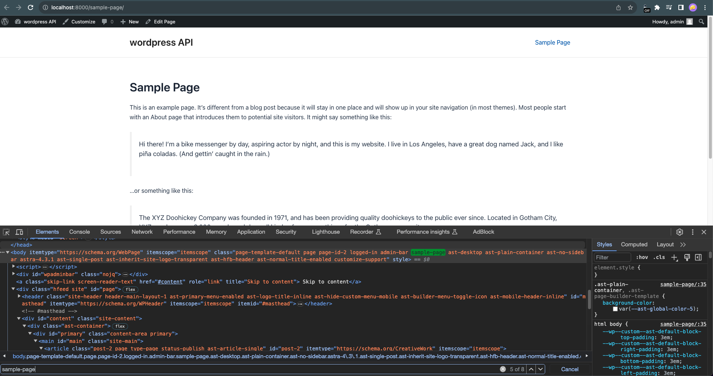

# Add Custom Class on Body

Enhance the styling possibilities of your WordPress website with the "Add Custom Class on Body" plugin. This powerful and versatile plugin allows you to dynamically add custom CSS classes to the `<body>` element, empowering you to customize the appearance of your site based on post slugs, custom post types, or current URLs.

## Features

- Dynamically adds a custom CSS class to the `<body>` element.
- Customize the CSS class based on the post's slug, custom post type, or the current URL.
- Enhance the visual design of your WordPress website effortlessly.

## Usage

Once the plugin is activated, it will automatically add a custom CSS class to the `<body>` element based on the post's slug, custom post type, or the current URL. This added flexibility in styling empowers you to tailor the appearance of your site to your specific needs, making it an ideal solution for custom post types.

## Frequently Asked Questions

**Q:** Can I customize the CSS class added to the body element?

**A:** Yes, you can customize the CSS class added to the body element by modifying the plugin settings.

**Q:** How can I remove the CSS class added by this plugin?

**A:** To remove the CSS class, simply deactivate the plugin.

## Changelog

### 1.0.0
- Initial release.

## Upgrade Notice

### 1.0.0
This is the initial release of the plugin.

## Screenshots

